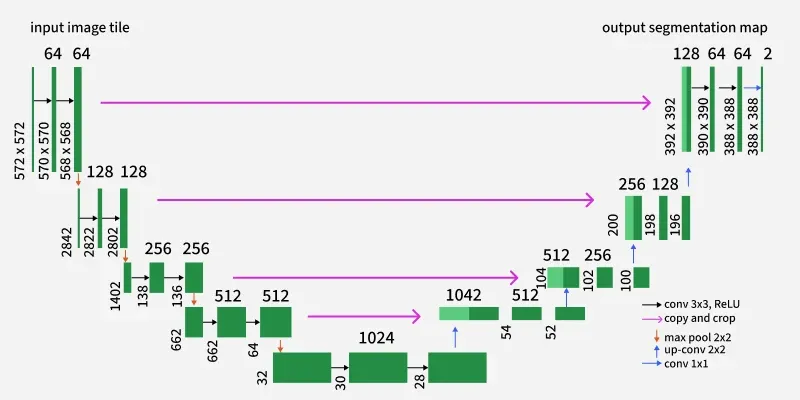

# From-Scratch Machine Learning Repository

A comprehensive repository for learning machine learning fundamentals through complete from-scratch implementations. This repository contains two independent projects that demonstrate building ML models using only PyTorch basics, without relying on high-level abstractions or prebuilt model libraries.

## Projects Overview

### 🖼️ U-Net Transformer Segmentation (`unet_transformer_seg/`)
Computer vision project implementing hybrid CNN-transformer architectures for image segmentation.

**Key Features:**
- Pure U-Net baseline implementation
- U-Net + Transformer hybrid with bottleneck integration
- Synthetic toy dataset for shapes segmentation
- From-scratch transforms and data loading
- Dice and IoU metrics implementation

### 🎤 Paraformer ASR (`paraformer_asr/`)
Automatic speech recognition project implementing Paraformer-style sequence-to-sequence models.

**Key Features:**
- Transformer/Conformer-style encoder from scratch
- Predictor module for token alignment estimation
- Decoder/refiner for token generation
- Greedy decoding implementation
- Synthetic sequence-to-sequence dataset generator

## Quick Start

### Prerequisites
- Python 3.10 or higher
- CUDA-capable GPU (recommended but not required)

### Setup and Run

1. **Clone and navigate to the repository**
```bash
git clone <repository-url>
cd from-scratch-ml-repo
```

2. **Choose a project and install dependencies**

For U-Net Transformer Segmentation:
```bash
cd unet_transformer_seg
pip install -r requirements.txt
```

For Paraformer ASR:
```bash
cd paraformer_asr
pip install -r requirements.txt
```

3. **Run training**

U-Net Transformer:
```bash
# Train baseline U-Net
python scripts/train.py --config configs/unet_baseline.yaml

# Train U-Net + Transformer hybrid
python scripts/train.py --config configs/unet_transformer.yaml
```

Paraformer ASR:
```bash
# Train Paraformer model
python scripts/train.py --config configs/paraformer_base.yaml
```

4. **Evaluate and run inference**

Both projects support evaluation and inference:
```bash
# Evaluate trained model
python scripts/eval.py --checkpoint runs/latest/checkpoints/best.pt

# Run inference
python scripts/infer.py --checkpoint runs/latest/checkpoints/best.pt --input <input_file>
```

## Learning Map

This repository is designed for progressive learning. Here's the recommended exploration order:

### 🎯 Phase 1: Understanding the Structure
1. **Start here:** Read this README and project-specific READMEs
2. **Explore configs:** Look at YAML configuration files to understand model variants
3. **Check documentation:** Read `docs/SPEC.md` and `docs/CONTRACTS.md` in each project

### 🔧 Phase 2: Core Infrastructure
1. **Configuration system:** `src/utils/config.py` - YAML loading and dataclass parsing
2. **Logging and checkpointing:** `src/utils/logging.py`, `src/utils/checkpoint.py`
3. **Tensor validation:** `src/utils/tensor_utils.py` - Shape assertions and debugging

### 📊 Phase 3: Data Pipeline
1. **Toy datasets:** `src/data/toy_*.py` - Synthetic data generation
2. **Data loading:** `src/data/dataset.py`, `src/data/dataloader.py`
3. **Transforms:** `src/data/transforms.py` - From-scratch image/sequence transforms

### 🧠 Phase 4: Model Architecture
1. **Basic blocks:** `src/models/blocks.py` - Fundamental building blocks
2. **Attention mechanisms:** `src/models/attention.py` - Multi-head attention from scratch
3. **Core models:** `src/models/unet.py`, `src/models/paraformer.py`

### 🏋️ Phase 5: Training and Evaluation
1. **Loss functions:** `src/losses/` - Custom loss implementations
2. **Metrics:** `src/metrics/` - Evaluation metrics from scratch
3. **Training loop:** `src/training/trainer.py` - Complete training pipeline
4. **Inference:** `scripts/infer.py` - Model inference and decoding

### 🧪 Phase 6: Testing and Validation
1. **Unit tests:** `tests/test_*.py` - Component validation
2. **Smoke tests:** `tests/smoke_*.py` - End-to-end training validation
3. **Integration tests:** `tests/integration_*.py` - CLI and pipeline testing

## Key Learning Concepts

### From-Scratch Implementation Philosophy
- **No high-level abstractions:** All components built using basic PyTorch operations
- **Explicit mathematics:** Every operation is implemented to show underlying math
- **Educational focus:** Code prioritizes clarity and learning over optimization

### Tensor Contracts and Debugging
- **Explicit shape documentation:** Every function documents input/output tensor shapes
- **Runtime validation:** Comprehensive assertions catch shape mismatches early
- **Debugging utilities:** Tools for detecting NaN/Inf values and gradient issues

### Experiment Management
- **Reproducible training:** Seed control and deterministic operations
- **Comprehensive logging:** Structured logging with CSV and JSON output
- **Result aggregation:** Scripts to compare experiments and generate summaries

## Extending the Repository

### Adding Real Datasets



**For U-Net Transformer Segmentation:**
Replace toy dataset in `src/data/toy_shapes.py` with real image/mask pairs:
```python
class RealSegmentationDataset:
    def __init__(self, image_dir, mask_dir):
        # Load real image and mask file paths
        pass
```

**For Paraformer ASR:**
Replace toy dataset in `src/data/toy_seq2seq.py` with real audio features:
```python
class RealASRDataset:
    def __init__(self, feature_dir, transcript_dir):
        # Load real audio features and transcripts
        pass
```

### Modifying Architectures

**Key modification points:**
- Model configurations in `configs/*.yaml`
- Architecture definitions in `src/models/`
- Loss functions in `src/losses/`
- Metrics in `src/metrics/`

### Adding New Model Variants

1. Create new config file in `configs/`
2. Implement model class in `src/models/`
3. Register model in `src/models/__init__.py`
4. Add corresponding loss/metric if needed

## Troubleshooting

### Common Issues

**Shape Mismatches:**
- Check tensor contract documentation in `docs/CONTRACTS.md`
- Use tensor validation utilities in `src/utils/tensor_utils.py`
- Enable debug logging for detailed shape information

**Training Issues:**
- Verify dataset generation with `python -m src.data.toy_shapes --debug`
- Check gradient flow with `python -m src.utils.debug --check-gradients`
- Monitor for NaN/Inf values in logs

**Memory Issues:**
- Reduce batch size in config files
- Enable gradient checkpointing if available
- Monitor GPU memory usage during training

### Getting Help

1. **Check documentation:** Each project has detailed docs in `docs/`
2. **Run smoke tests:** Verify setup with `python -m pytest tests/smoke_*.py`
3. **Enable debug logging:** Set `debug: true` in config files
4. **Review tensor contracts:** Check expected shapes in `docs/CONTRACTS.md`

## Dependencies and Constraints

### Allowed Dependencies
- **Core:** Python 3.10+, PyTorch (tensor + autograd), numpy, pyyaml, tqdm, matplotlib
- **Optional:** torchvision (I/O only), FastAPI + uvicorn (ASR service)

### Prohibited Dependencies
- **No prebuilt models:** FunASR, ModelScope, HuggingFace transformers, torchaudio pipelines
- **No high-level frameworks:** mmseg, mmdet, detectron2, lightning, accelerate
- **No external model libraries:** Any library providing prebuilt model architectures

This constraint ensures all learning happens through explicit implementation of fundamental concepts.

## Project Independence

Each subproject is completely independent:
- **No shared code:** Each project has its own complete implementation
- **Independent dependencies:** Separate requirements.txt files
- **Separate experiment tracking:** Independent run directories and logging
- **Isolated testing:** Each project has its own test suite

This design allows focused learning on specific architectures without cross-project complexity.

## Contributing

When extending this repository:
1. Maintain the from-scratch implementation philosophy
2. Document all tensor contracts explicitly
3. Include comprehensive tests for new components
4. Update documentation and learning maps
5. Ensure reproducible experiments with proper seeding

## License

[Add appropriate license information]
